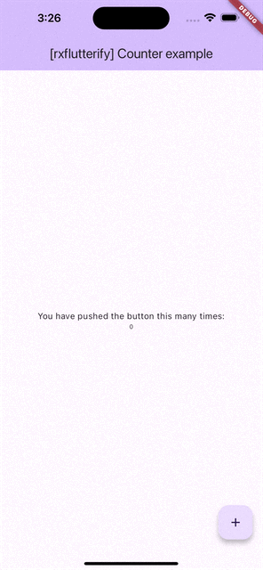

# rxflutterify - Counter example

## Getting Started

This project is an usage of `rxflutterify`.



In this example, the Stream of values is generated as follows. Essentially, it will produce a BehaviourSubject using the rxdart library.

```dart
final _counter = 0.react;
```