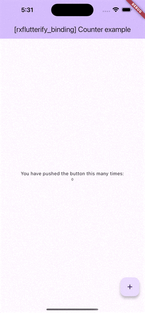
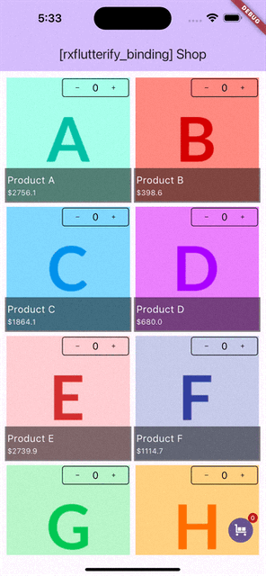

# rxflutterify_binding examples

## [Counter](./counter/)

In this example, the Stream of values is generated as follows. Essentially, it will produce a BehaviourSubject using the rxdart library.

```dart
final _counter = 0.react;
```



## [Pub search](./api_search/)

This is an illustration of implementing the MVVM using the RxDart.
While there may be more optimized approaches, the implementation has been intentionally kept straightforward to serve as a clear example.


## [Shopping cart](./cart/)

This is an illustration of implementing the MVVM using the RxDart.
While there may be more optimized approaches, the implementation has been intentionally kept straightforward to serve as a clear example.

