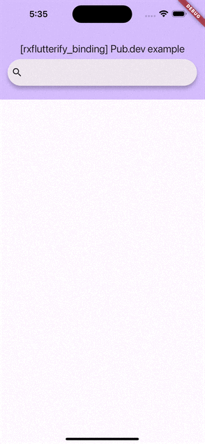

# rxflutterify_binding - Pub search example

## Getting Started

This project is an usage of `rxflutterify_binding`.

This is an illustration of implementing the MVVM using the RxDart.
While there may be more optimized approaches, the implementation has been intentionally kept straightforward to serve as a clear example.

